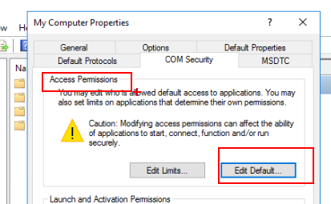
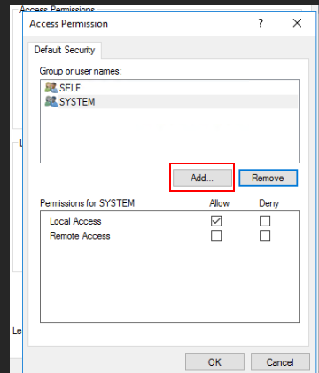
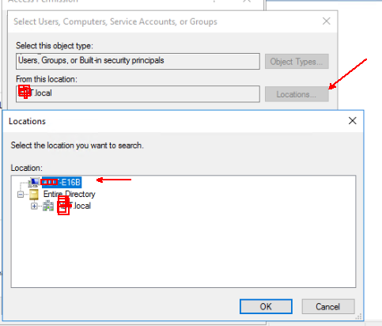
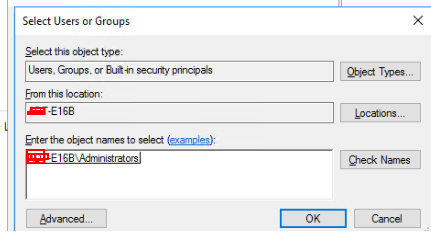

# VSSTester

Download the latest release: [VSSTester.ps1](https://github.com/microsoft/CSS-Exchange/releases/latest/download/VSSTester.ps1)

The script is self-explanatory. You can test run diskshadow on a single Exchange database to ensure backups are working properly (i.e. all the Microsoft components). If the issue only happens with a 3rd-party backup solution, you can utilize operation mode 2 to enable just the logging while you execute a backup with the 3rd-party solution.

## More information
* https://techcommunity.microsoft.com/t5/exchange-team-blog/troubleshoot-your-exchange-2010-database-backup-functionality/ba-p/594367
* https://techcommunity.microsoft.com/t5/exchange-team-blog/vsstester-script-updated-8211-troubleshoot-exchange-2013-and/ba-p/610976

## COM+ Security

Here are the steps to verify that the local Administrators group is allowed to the COM+ Security on the computer. The script will detect if this is a possibility if we can not see the Exchange Writers and we have the registry settings set that determine this is a possibility.

1. Run "dcomcnfg" from the run box or command prompt on the problem machine
2. Expand Component Services then Computers
3. Right Click on My Computer and select Properties

4. Select the COM Security tab and select Edit Default... under Access Permissions

5. If the local Administrators group is not here for Allow for Local and Remote Access, click Add... to add the local Administrators group to the Default Security permissions

6. Change the locations to the computer name

7. Type in "Administrators" and select Check Names. Making sure the computer account comes up

8. Add Local Access and Remote Access for Allow
9. Click Okay
10. Click Apply and Okay
11. Restart the Computer