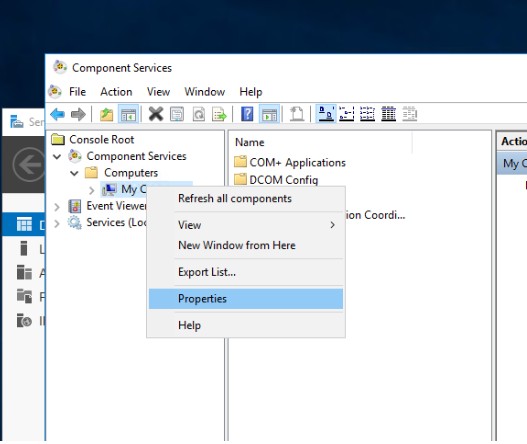

# VSSTester

Download the latest release: [VSSTester.ps1](https://github.com/microsoft/CSS-Exchange/releases/latest/download/VSSTester.ps1)

## Usage

### Trace while using a third-party backup solution

`.\VSSTester -TraceOnly -DatabaseName "Mailbox Database 1637196748"`

Enables tracing of the specified database. The user may then attempt a backup of that database
and use Ctrl-C to stop data collection after the backup attempt completes.

### Trace a snapshot using the DiskShadow tool

`.\VSSTester -DiskShadow -DatabaseName "Mailbox Database 1637196748" -DatabaseDriveLetter M -LogDriveLetter N`

Enables tracing and then uses DiskShadow to snapshot the specified database. If the database and logs
are on the same drive, the snapshot is exposed as M: drive. If they are on separate drives, the snapshots are
exposed as M: and N:. The user is prompted to stop data collection and should typically wait until
log truncation has occurred before doing so, so that the truncation is traced.

### Trace in circular mode until the Microsoft Exchange Writer fails

`.\VSSTester -WaitForWriterFailure -DatabaseName "Mailbox Database 1637196748"`

Enables circular tracing of the specified database, and then polls "vssadmin list writers" once
per minute. When the writer is no longer present, indicating a failure, tracing is stopped
automatically.

## More information
* https://techcommunity.microsoft.com/t5/exchange-team-blog/troubleshoot-your-exchange-2010-database-backup-functionality/ba-p/594367
* https://techcommunity.microsoft.com/t5/exchange-team-blog/vsstester-script-updated-8211-troubleshoot-exchange-2013-and/ba-p/610976

Note that script syntax and output has changed. Syntax and screenshots in the above articles are out of date.

## Missing Microsoft Exchange Writer
We have seen a few cases where the Microsoft Exchange Writer will disappear after an unspecified amount of time and restarting the Microsoft Exchange Replication service. Steps on how to resolve this are linked here:

* https://learn.microsoft.com/en-US/troubleshoot/windows-server/backup-and-storage/event-id-513-vss-windows-server

## COM+ Security

Here are the steps to verify that the local Administrators group is allowed to the COM+ Security on the computer. The script will detect if this is a possibility if we can not see the Exchange Writers and we have the registry settings set that determine this is a possibility.

1. Run "dcomCnFg" from the run box or command prompt on the problem machine
2. Expand Component Services then Computers
3. Right Click on My Computer and select Properties

4. Select the COM Security tab and select Edit Default... under Access Permissions

5. If the local Administrators group is not here for Allow for Local and Remote Access, click Add... to add the local Administrators group to the Default Security permissions

6. Change the locations to the computer name

7. Type in "Administrators" and select Check Names. Making sure the computer account comes up

8. Add Local Access and Remote Access for Allow
9. Click Okay
10. Click Apply and Okay
11. Restart the Computer

