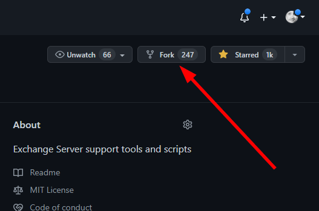
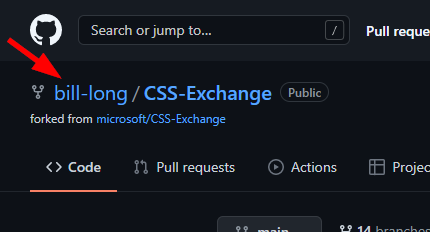
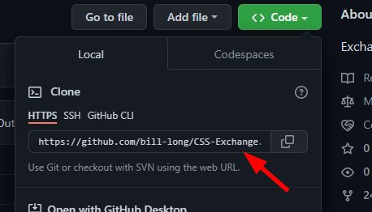
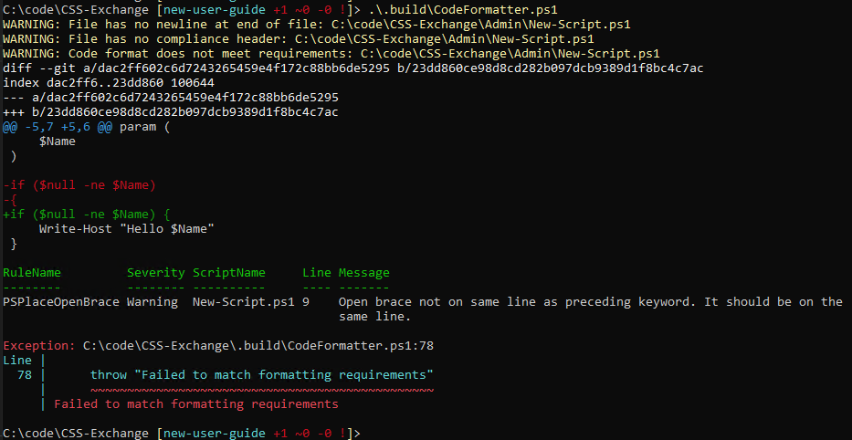
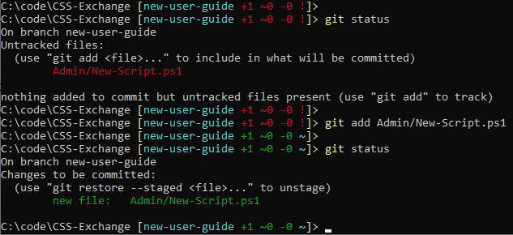
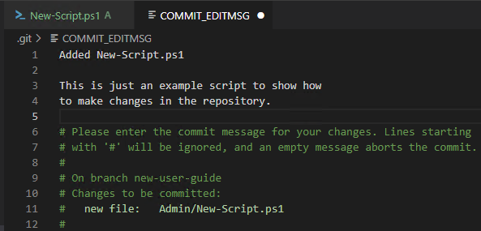
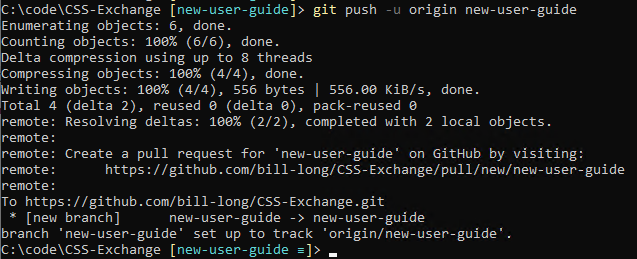
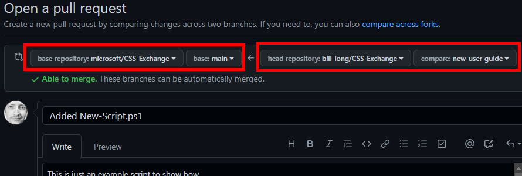

---
hide:
    - navigation
---

# New User Guide

## Introduction

If you are new to Git and GitHub, and you want to contribute to CSS-Exchange, you've come to the right place.

There are many, many resources on how to use Git and GitHub. We recommend starting with [Pro Git](https://git-scm.com/book/en/v2). Reading chapters 1 to 3 provides a great foundation for understanding and using Git.

This page will serve as a quick start that leads you through submitting a Pull Request to CSS-Exchange step by step.

This page will *not* cover the use of any GUI that attempts to insulate the user from the Git command line. In this author's opinion, the only way to really learn Git is to use the command line, so that's all we'll cover here.

## Before You Start

If you are considering a large change to a script or a brand new script, it's often a good idea to open an Issue first to discuss the change. This will allow the repository owners to provide feedback on whether they would accept this type of change. By getting feedback before you spend days on a complex change, you can ensure that you're not wasting your time.

## Installation

* Install [PowerShell 7 or later](https://docs.microsoft.com/en-us/powershell/scripting/install/installing-powershell).
* Install [Visual Studio Code](https://code.visualstudio.com/). You'll need this to develop scripts for this project.
* Assuming you're running Windows, install [Git For Windows](https://git-scm.com/download/win). When it asks for your default editor, choose Visual Studio Code. The rest of the defaults are fine. If you're on a different operating system, refer to the [Git documentation](https://git-scm.com/docs/git-install) for instructions.
* Optional but recommended: Install [Posh Git](https://github.com/dahlbyk/posh-git) in your PowerShell 7+ shell. This adds some useful features such as branch name autocompletion in PowerShell.

## Forking the repository

The first step is to fork the repository on GitHub. Unless you have Write access to CSS-Exchange, you can't push directly to our repo. Creating a fork creates your own copy of the repo on GitHub, so you have somewhere to push your changes.

To fork the repository, use the Fork icon at the top right of the repository page.



You'll be prompted for a name and description. The defaults are fine. When the fork is complete, you'll be taken to the new repository page. At the top left, you should see that you are now on your own fork.



## Cloning the repository

Now you're ready to start using the git command line. To clone the repository, drop down the Code button and copy the URL:



Then use that URL to clone the repository using the command line:

```powershell
git clone <url>
```

This creates a folder called `CSS-Exchange` in your current directory.

## Creating a new branch

Change into the folder that was just created. Your shell should now look something like this.


Because we have PoshGit loaded, it's showing our current branch name in the prompt - main. Let's create a new branch for our work. It's nice to use a descriptive name. For example, if we're updating this guide, we might call name it like so:


## Making changes

Now that you're on your own branch, you're ready to make your changes. You can technically use any tool you like - notepad, vim, whatever. But, if you open the repo root folder in Visual Studio Code, many of the repository formatting settings will be applied automatically. You can also shift-alt-F to reformat a file according to the settings. This may save you some time later.

For this example, I created a new script called New-Script.ps1.

After making our changes, it's a good idea to verify that git sees everything we changed, and that we haven't changed any files we didn't intend to. Because we have PoshGit, just hitting Enter to get a new prompt shows us some information about how many files have changed. We can also run `git status` to see some details.


This looks good. My intent was to add one script file, and that's the only change shown here.

## Formatting changes

CSS-Exchange has some formatting requirements to ensure consistency, and these checks are integrated into our build process. Before committing changes, let's run `.build\CodeFormatter.ps1` to see if our new script meets the requirements.



CodeFormatter highlighted a few problems here:

* File has no newline at the end.
* File is missing the required compliance header.
* File has no BOM. We require a BOM on scripts.
* The formatting of the code itself is not using the correct brace style. This is shown in a warning, followed by diff output illustrating the required change. In addition, a PSScriptAnalyzer check at the end highlights the same issue with the PSPlaceOpenBrace rule.

CodeFormatter will fix some problems automatically if the -Save switch is included. Let's run it again with -Save.


Here we see CodeFormatter automatically fixed all of these issues when run with the -Save switch. Running a second time, we can confirm everything was fixed, as it generates no output at all.

## Staging changes

We're almost ready to commit our changes, but first we should stage them. Staging gives us a chance to sanity-check what we're about to commit before we actually commit. It's especially useful when we have modified several files for testing, but we only intend to commit some of them.

If we run `git status` again, we should once again see that only one file is modified for our simple test case. Then we can stage our file with `git add`, and check the result again with `git status`.



When we have many files to commit, we can use `git add .` to stage all files in the current folder and subfolders, or `git add :/` to stage all files everywhere. When using those options, it's especially important to check `git status` to make sure we haven't staged something we didn't intend to.

## Committing changes

If `git status` shows that the correct files are staged, we can commit them with `git commit`. This will open
the default editor, which will be Visual Studio Code if you chose it when installing Git as described earlier.



The top line should be the title of the commit. Then skip a line and add further details as necessary.
Close the tab, choose Save when prompted, and we see the following output.


Now our changes are committed to our local copy of our branch, but we need to push those to GitHub.

## Pushing the changes

Because this is the first time we're pushing changes for our new branch, we have to provide a few details. On our first push of our new branch, the syntax will be `git push -u origin <branch name>`.



Origin means we're pushing to the location we cloned from - this is the name of the remote repo by default. The `-u` parameter tells it to set this as our upstream for this branch. We only have to do this the first time. If we make additional changes on this branch and commit them, we can now push them to the server with a simple `git push`, since we have now told it that origin will be our upstream going forward.

Now we're ready to request that our changes be pulled into the official repo.

## Creating a Pull Request

There are a few ways to create a Pull Request. We can see in the previous screenshot that GitHub helpfully shows us a URL we can visit to start a Pull Request. You can also manually navigate to the Pull Request tab of the official repo, and create a new Pull Request there. You might even see a prompt to create a PR for the branch you just pushed. Either of these methods will work.


At this point we're presented with a form to provide some details about the PR. Be sure that at the top of the PR form, we see the offical repo and the `main` branch on the left, followed by your fork and the branch you created on the right.



Fill in the details and hit Create Pull Request.

## Responding to feedback

The repository owners will often request some changes to our code by commenting on the Pull Request. To update the code in the Pull Request, simply make the additional changes in your local files, stage them, and commit them just as before. Then, `git push`. Remember, we don't need any other parameters on the push this time. After pushing new changes, we should see the PR update almost instantly.

Once the owners are satisfied with the changes, they will approve and merge the PR. And we're done!

## Cleaning up

Once the PR is merged, we can delete our fork and delete the folder containing our local clone. We can keep the fork around if we intend to contribute further, but the `main` branch of the fork will not automatically pull in the latest changes from the official repo. It will get further and further out of date, which may cause problems with future pull requests. To avoid this, we'll need to pull in the changes from the `main` branch of the official repo into our fork. This is out of scope for this guide, so we'll leave this an exercise for the reader.
