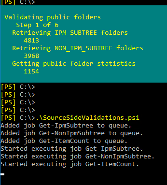
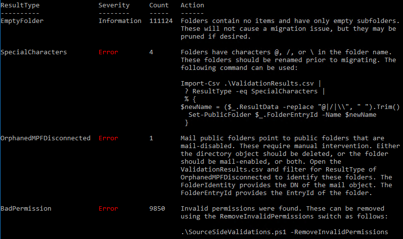
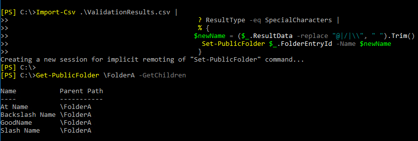
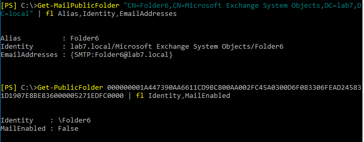
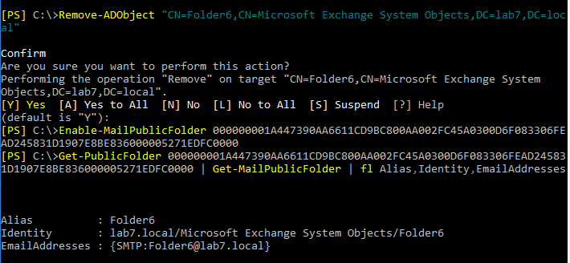

# SourceSideValidations

Download the latest release: [SourceSideValidations.ps1](https://github.com/microsoft/CSS-Exchange/releases/latest/download/SourceSideValidations.ps1)

This script performs pre-migration public folder checks for Exchange 2013, 2016, and 2019. For Exchange 2010, please use previous script found [here](https://www.microsoft.com/en-us/download/details.aspx?id=100414).

## Syntax

```powershell
SourceSideValidations.ps1
  [-StartFresh <bool>]
  [-SlowTraversal]
  [-ResultsFile <string>]
  [-SkipVersionCheck]
  [-Tests <string[]>]
  [<CommonParameters>]
SourceSideValidations.ps1 -RemoveInvalidPermissions
  [-ResultsFile <string>]
  [-SkipVersionCheck]
  [<CommonParameters>]
SourceSideValidations.ps1 -SummarizePreviousResults
  [-ResultsFile <string>]
  [-SkipVersionCheck]
  [<CommonParameters>]
```

## Output

The script will generate the following files. Usually the only one we care about is ValidationResults.csv. The others are purely for saving time on subsequent runs.

File Name|Content|Use
-|-|-
IpmSubtree.csv|A subset of properties of all Public Folders|Running with -StartFresh $false loads this file instead of retrieving fresh data
Statistics.csv|EntryID, item count, and size of every folder|Running with -StartFresh $false loads this file instead of retrieving fresh data
NonIpmSubtree.csv|A subset of properties of all System Folders|Running with -StartFresh $false loads this file instead of retrieving fresh data
ValidationResults.csv|Information about any issues found. This is file we want to examine to understand any issues found.|The script will display a summary of what it found, and in many cases it will provide an example command that uses input from this file to fix the problem.

## Tests

The script performs the following tests. The ValidationResults.csv can be filtered by ResultType to identify the respective folders.

Test Category|ResultType|Criteria
-|-|-
DumpsterMapping|BadDumpsterMapping|DumpsterEntryId is null, or the dumpster is not in \NON_IPM_SUBTREE\DUMPSTER_ROOT, or the DumpsterEntryId of the dumpster does not point back to the folder.
Limit|ChildCount|The folder has more than 10,000 direct child folders.
Limit|EmptyFolder|The folder and all its child folders (recursive) have no items.
Limit|FolderPathDepth|The folder path is greater than 299 folders deep.
Limit|HierarchyCount|There are more than 250,000 total folders in the hierarchy.
Limit|HierarchyAndDumpsterCount|There are more than 250,000 total folders if you count both the folders and their dumpsters.
Limit|ItemCount|The folder has more than 1,000,000 items.
Limit|NoStatistics|Get-PublicFolderStatistics did not return any statistics for these folders. ItemCount, TotalItemSize, and EmptyFolder tests were skipped.
Limit|TotalItemSize|The items directly in this folder (not child folders) add up to more than 25 GB.
MailEnabledFolder|MailDisabledWithProxyGuid|The folder is not mail-enabled, but it has the GUID of an Active Directory object in its MailRecipientGuid property.
MailEnabledFolder|MailEnabledSystemFolder|The folder is a system folder, which should not be mail-enabled.
MailEnabledFolder|MailEnabledWithNoADOjbect|The folder is mail-enabled, but it has no Active Directory object.
MailEnabledFolder|OrphanedMPF|An Active Directory object exists, but it is not linked to any folder.
MailEnabledFolder|OrphanedMPFDuplicate|An Active Directory object exists, but it points to a public folder which points to a different object.
MailEnabledFolder|OrphanedMPFDisconnected|An Active Directory object exists, but it points to a public folder that is mail-disabled.
FolderName|SpecialCharacters|Folder name contains @, /, or \\.
Permission|BadPermission|The permission does not refer to a valid entity.

## Usage

Typically, the script should be run with no parameters:

```powershell
.\SourceSideValidations.ps1
```

Progress indicators are displayed as it collects data and validates the results.



The final test, which checks permissions, will usually take much longer than the other tests.

When all the tests are done, the script provides a summary of what it found, along with example commands that fix some issues.



In this example output, the script calls out four issues.

First, it points out that we have 111,124 folders that are completely empty (this is a lab). Note the ResultType of EmptyFolder. If we want to see the list of empty folders, we can open up ValidationResults.csv in Excel, filter for a ResultType of EmptyFolder, and then we see all those results:


For these folders, no action is required. The script is just giving us information.

The next thing it calls out is that 4 folders have problematic characters in the name. The output tells us these have a ResultType of SpecialCharacters. Filtering for that in the CSV, we see the folders.


Fortunately, the script gives us a command we can run to fix all the names. We can copy and paste the command it gave us, let it run, and then spot check the result.



Now that the names are fixed, we move on to the next item.

The script tells us we have a mail public folder object for a public folder that is mail-disabled. For this type of problem, we need to examine the folder and figure out what we want to do. The CSV file gives us the DN of the mail object and the entry ID of the folder, which we can use to examine the two objects.




The folder says MailEnabled is False, yet we have a MailPublicFolder which points to it. We need to decide whether we want the folder to receive email or not. For this lab, I decide I _do_ want the folder to be mail-enabled, so I remove the orphaned MailPublicFolder and then mail-enable the folder.



I also confirm the new object has the same email address as the old one. This might need to be adjusted manually in some cases, but here I didn't have to.

Finally, the script says we have 9,850 invalid permissions. Fortunately, this is another one that is easy to fix, as the script provides a command.


This one is going to take a while. Once completed, we can rerun SourceSideValidations to make sure all the issues are resolved.

If you close the shell and you need to see the summary results again, use the *-SummarizePreviousResults* switch.

```powershell
.\SourceSideValidations -SummarizePreviousResults
```

The script reads the output file and repeats the instructions on what to do. You can also summarize the results from previous runs, or point to files in other locations, by providing the *-ResultsFile* parameter.
